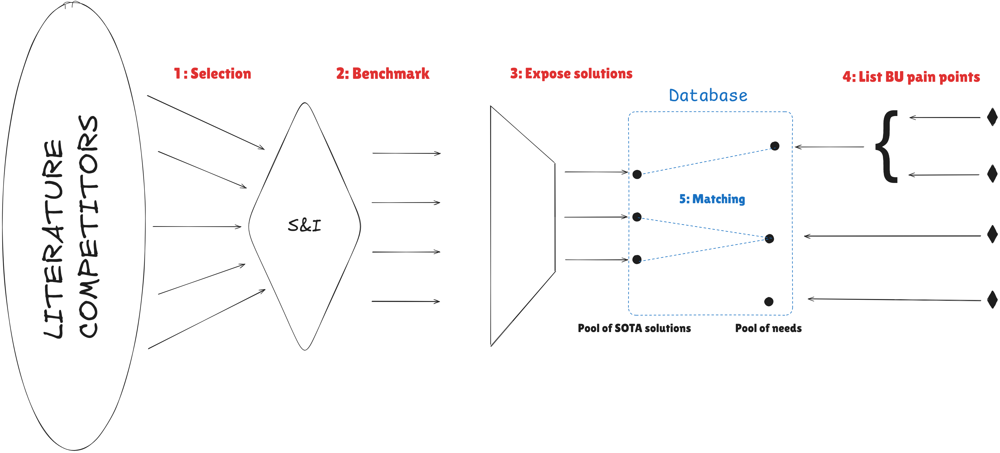

# 🔬 Innovation Marketplace

> **An asynchronous semantic matching platform connecting innovation solutions with business unit needs.**

A Streamlit-based demonstration of a systematic workflow to bridge the gap between S&I innovation projects and business demand, reducing time-to-impact while ensuring solutions are discoverable, reusable, and impactful.

---

## 🎯 The Challenge

Innovation teams generate valuable knowledge, methods, and ideas—but these intangible assets have no physical "place to live" except in our brains. This creates a timing bottleneck:

1. **S&I Team** needs to keep **up to date** about AI opportunities
2. S&I has to **bring impact to business units** without "running behind"
3. Need to **benchmark** and demonstrate efficiency of innovation projects
4. Need **reusable and evolution-ready solutions**
5. Need better **exposition of innovative works**
6. Need **comprehension of business unit (BU) needs**
7. **Timing mismatch** — solution offer and business demand are misaligned
8. **Speed** — accelerate time-to-impact

### The Root Problem

When innovation is discovered, documented, and evaluated in isolation, it cannot connect with emerging business needs at the right moment. Conversely, when business needs are articulated, no systematic way exists to search for relevant past work across the organization.

---

## 💡 The Solution: An Internal Innovation Marketplace

**Core Idea:** Create a **digital "marketplace"** where innovation solutions meet business demand asynchronously—decoupling creation time from adoption time.

Instead of waiting for perfect timing between project completion and business readiness, this platform allows:
- ✅ Solutions to live and be discoverable in a centralized portfolio
- ✅ Business needs to be formulated, stored, and searched at any time
- ✅ Semantic matching to surface relevant connections automatically
- ✅ Reusability across projects and teams

---

## 🔄 The Five-Step Workflow



### 1️⃣ **Selection**

To stay ahead of innovation and avoid running behind business needs, S&I must continuously explore emerging trends, literature, and competitor innovations. This first step constist in extracting pormising research directions among this amount of information.

**Activities:**
- Automated literature review (coordinated effort, shared tools)
- Competitive intelligence gathering
- Identification of exploratory projects with potential value

---

### 2️⃣ **Benchmarking**

This stage concerns launched research projects. Any research work's value is legitimized through comparison against **standardized datasets with well-defined metrics**.

**Approach:**
- Develop **POCs**  that demonstrate added value without targeting full industrialization (limited time invested)
- Use **standard benchmark datasets** across the organization
- Document reproducible results and metrics
- Avoid wasting development time on projects without validated RIO

**Outcomes:** Benchmarked POC with clear metrics showing relative performance

---

### 3️⃣ **Expose Solutions**

Solutions are packaged and exposed in two formats:

#### **POC (Proof of Concept)**
- Result of short exploratory work leading to benchmarked results
- Not yet ready to industrialize
- **Duration:** Few months maximum
- **Goal:** Demonstrate feasibility and impact quickly

**Reusability Challenge:** Look for redundancies across research projects. For example:
- If work exists on anomaly detection for *images* and separately for *time series*, create a general Python package applicable to both
- Abstract methods beyond their original problem context
- Build solutions that work *independent of input type and domain specificity*
- Shift toward *problem agnostic* solutions

#### **Proposal (Research Direction)**
- Well-documented potential research directions
- Exposed to entire organization for impact assessment and feasibility review
- Helps pool resources and mitigate risks
- BUs can "vote" for proposals to support launch decisions

#### **Exposure Formats** (by priority)

1. **1-Page Keynote** — high-level summary with general taxonomy
2. **Contact List** — key stakeholders for dialogue
3. **Reproducible Code** — fully documented and executable
4. **5-Minute Video** — quick overview for busy stakeholders

**Digital Storage:** Solutions are catalogued in a **vector database** enabling semantic search and information retrieval across unstructured documentation.

---

### 4️⃣ **List Pain Points**

After an exhaustive inventory of business pain points, stakeholders (PMs, domain experts, or anyone in S&I) write keynotes describing their needs precisely.

**Process:**
- Document pain point in concrete business language
- Optionally rewrite using **LLMs** into more abstract, generic language facilitating matching with solution syntaxe
- **Note:** S&I members can also register internal needs (e.g., "I need a benchmark for anomaly detection with standard metrics"), allowing cross-team reuse

**Key Insight:** A well-formulated internal pain point from one team may avoid repetitive work for other BUs.

---

### 5️⃣ **Matching**

With precise solution descriptions and refined business need formulations, an **asynchronous "marketplace"** emerges where supply and demand meet at any time.

**Matching Mechanism:**
- Semantic search powered by keyword overlap (demo) or vector embeddings (futurn versions)
- Multiple discovery modes:
  - Search for solutions matching a specific business need
  - Browse solutions and see which needs they address
  - View full solution × need correlation matrix
- **Result:** Ranked matches with relevance scores

---

## ✨ Key Characteristics of This Workflow

### 🎯 **Measurable Success**

Track organizational learning and impact:

| Metric | Definition | Use Case |
|--------|-----------|----------|
| **Reusability %** | % of innovation projects reused across teams | Assess packaging quality and abstraction |
| **Adoption %** | % of exposed solutions matched with needs | Gauge portfolio quality |
| **Unmatchable %** | % of solutions with no matches | Extract patterns → inform future exploration |
| **Time-to-Match** | Days between solution exposure and first match | Measure marketplace velocity |

### 🏆 **Support Project Ranking**

Systematically answer questions for prioritization:
- **What is the best match?** → Closest innovation to business need (highest relevance score)
- **Easiest to industrialize?** → Consider complexity score and resource requirements
- **Most impactful?** → Combine adoption score, business need urgency, and strategic alignment
- **Most resource-hungry?** → Filter by estimated development effort

### 🤝 **Bridge Business-S&I Dialogue**

- **From S&I perspective:** Satisfying to expose work to anyone spending time on the innovation marketplace
- **From BU perspective:** Simple 1-page need description (no lengthy meetings, no lexical friction)
- **Interface:** Dedicated persons or LLMs mediate between domains

---

## ✨ Platform Features

### 📊 Overview Dashboard
- Real-time statistics (# solutions, # needs, # matches)
- Historical activity feed (recent benchmarks, registrations, new matches)
- Interactive workflow visualization
- Quick links to each module

### 🧪 Solutions Portfolio
- Filterable grid of POCs and proposals
- Filter by: Type (POC/Proposal), Domain, Status
- Each card displays title, description, tags, and status badge
- Click to expand and see:
  - Full description and methodology
  - Benchmarked metrics and results
  - Difficulty score and resource requirements
  - Links to reproducible code and demo
  - Matched business needs ranked by relevance

### 🏢 Business Unit Needs
- Structured pain-point cards with urgency indicators
- Organized by business unit and category
- Keywords and tags for semantic matching
- Click to see:
  - Detailed problem context
  - Strategic importance and timeline
  - Matched innovation solutions ranked by relevance score
  - Contact information for further dialogue

### 🔗 Matching Engine
Two complementary views:

- **📍 Find Solutions** — Select a business need → see all ranked solutions with relevance % bars
- **📋 Heatmap** — Full solution × need correlation matrix, color-coded by match strength (green=strong, yellow=partial, red=weak/none)

---

## 🚀 Quick Start

### Prerequisites
- Python 3.8+
- pip

### Installation

```bash
# Clone repository
git clone https://github.com/davidaleprog/innovation_app.git
cd innovation_app

# Create virtual environment (optional but recommended)
python -m venv venv
source venv/bin/activate  # On Windows: venv\Scripts\activate

# Install dependencies
pip install -r requirements.txt
```

### Run Locally

```bash
streamlit run app.py
```

The app opens at `http://localhost:8501`

---

## 📁 Project Structure

```
innovation_app/
├── app.py                      # Main Streamlit entry point
├── data.py                     # Solution & BU need data models
├── styles.py                   # Shared CSS styling
├── utils.py                    # Matching algorithms & helpers
├── views/
│   ├── __init__.py
│   ├── overview.py            # Dashboard & workflow intro
│   ├── solutions.py           # Portfolio list + detail view
│   ├── bu_needs.py            # BU needs list + detail view
│   └── matching.py            # Semantic search & heatmap
├── media/                      # Screenshots & assets
├── data/                       # Data models and sample data
│   ├── __init__.py
│   ├── solutions.py          # Solution catalog
│   └── bu_needs.py           # Business unit needs
├── requirements.txt
├── .gitignore
└── README.md
```

---

## 🔧 Matching Algorithm

Currently uses **keyword overlap** as a matching proxy:

$$\text{Match Score} = \frac{|\text{Solution Keywords} \cap \text{Need Keywords}|}{min(|S|, |N|)} \times 100$$

**Match Strength Legend:**
- 🟢 **Strong (≥60%)** — high semantic similarity, likely relevant
- 🟡 **Partial (30–59%)** — moderate overlap, worth exploring
- 🔴 **Weak (<30%)** — minimal connection, likely irrelevant

**Future Enhancement:** Vector embeddings (e.g., OpenAI embeddings + semantic search) for more sophisticated similarity detection across unstructured documentation.

---

## 📊 Data Models

### Solution
```python
{
    "id": "SOL-001",
    "title": "Anomaly Detection Framework",
    "type": "POC",  # or "Proposal"
    "domain": "Quality Control",
    "tags": ["time-series", "images", "unsupervised"],
    "difficulty": 3,
    "desc": "Full description...",
    "status": "Available",  # or "Proposed"
    "keywords": ["anomaly", "defect", "detection", ...]
}
```

### BU Need
```python
{
    "id": "BU-001",
    "unit": "Operations — Plant Lyon",
    "title": "Reduce false alarms on sensor lines",
    "desc": "Full problem statement...",
    "urgency": "High",  # or "Medium", "Low"
    "keywords": ["anomaly", "time series", "detection", ...]
}
```

---

## 🎓 Example Workflow

1. **Browse Solutions** → See "Anomaly Detection Framework" (POC, ⭐⭐⭐ difficulty)
2. **Click "View details"** → Read full description, see matching needs
3. **See Match** → "Reduce false alarms on sensor lines" (🟢 Strong 80% match)
4. **Click "View need details"** → Understand plant Lyon's pain point
5. **See Matched Solutions** → Confirm anomaly detection is ranked #1 for this need
6. **Take Action** → Connect operations team with S&I team

---

## 💼 Use Cases

### **For S&I Teams**
- **Portfolio Review:** See all past POCs and understand what's been explored
- **Avoid Duplication:** Search before starting new project
- **Discover Reusability:** Find related work to abstract and generalize
- **Track Impact:** Monitor which solutions get adopted

### **For Business Units**
- **Solution Discovery:** Describe a problem → find relevant past innovations
- **Accelerated Pilots:** Access benchmarked POCs ready for customization
- **Prioritize Needs:** Vote on proposals to guide S&I exploration roadmap
- **Cross-Team Learning:** Share pain points and solutions across BUs

---

## 🛠️ Configuration & Extension

### Add New Solutions

Edit `data.py` → append to `SOLUTIONS`:

```python
{
    "id": "SOL-007",
    "title": "Your Innovation Title",
    "type": "POC",
    "domain": "Your Domain",
    "tags": ["tag1", "tag2"],
    "difficulty": 2,
    "desc": "Problem it solves...",
    "status": "Available",
    "keywords": ["keyword1", "keyword2", ...],
}
```

### Add New BU Needs

Edit `data.py` → append to `BU_NEEDS`:

```python
{
    "id": "BU-006",
    "unit": "Your Business Unit",
    "title": "Your Problem",
    "desc": "Detailed problem statement...",
    "urgency": "High",
    "keywords": ["keyword1", "keyword2", ...],
}
```

### Customize Styling

Edit `styles.py` to change colors, fonts, or component styling. Currently uses a professional dark theme with blue accents.

---

## 🚢 Deployment

### Option 1: Streamlit Cloud (Recommended) ⭐

1. Push repo to GitHub
2. Go to [share.streamlit.io](https://share.streamlit.io)
3. Connect your GitHub account
4. Select this repository → Deploy
5. Get live URL: `https://your-app.streamlit.app`

### Option 2: Hugging Face Spaces

1. Create new Space with Streamlit runtime
2. Link to this GitHub repo
3. Auto-deploys on push

### Option 3: Docker + Cloud Run / Railway / Render

```dockerfile
FROM python:3.9-slim
WORKDIR /app
COPY requirements.txt .
RUN pip install -r requirements.txt
COPY . .
CMD ["streamlit", "run", "app.py"]
```

---

## 📈 Success Criteria

An effective Innovation Marketplace achieves:

1. ✅ **Reduced Time-to-Impact** — faster connection between innovation and business need
2. ✅ **Increased Reusability** — solutions generalized and applied across multiple contexts
3. ✅ **Improved Resource Efficiency** — less redundant work, better-informed project decisions
4. ✅ **Better Risk Mitigation** — proposals expose difficulty and resource requirements upfront
5. ✅ **Enhanced Visibility** — all innovations and needs discoverable and searchable
6. ✅ **Asynchronous Collaboration** — no dependency on perfect timing between teams

---

## 📖 Conceptual Foundations

This workflow is grounded in the principle that **innovation is knowledge that needs a home**.

By creating a digital, semantic, and accessible place for solutions and needs to coexist:
- Solutions don't languish in notebooks or emails
- Business needs don't go unanswered for lack of visibility
- The entire organization benefits from shared learning
- Innovation becomes a scalable organizational capability, not a scarce resource

---

## 🤝 Contributing

Contributions welcome! To add features:

1. Fork the repo
2. Create feature branch (`git checkout -b feature/my-feature`)
3. Commit changes (`git commit -m "Add my feature"`)
4. Push to branch (`git push origin feature/my-feature`)
5. Open a Pull Request

---

## 📝 License

MIT License — see [LICENSE](LICENSE) file for details.

---

## 👤 Author

**Alexis David** — Schneider Electric Innovation Team

- 🔗 [GitHub](https://github.com/davidaleprog)
- 💼 [LinkedIn](https://linkedin.com/in/alexis-david)

---

**Questions or Feedback?** Open an issue or reach out!  
**Last Updated:** June 2026  
**Version:** 1.0 (Alpha Demo)
